# 🤖 AI-Powered DevSecOps CI/CD Pipeline

A CI/CD pipeline that explains its own failures. Jenkins runs on Kubernetes with dynamic build agents, gates deployments behind a Trivy security scan, and — when something breaks — hands the logs to a local AI model that diagnoses the root cause and reports it to Slack.


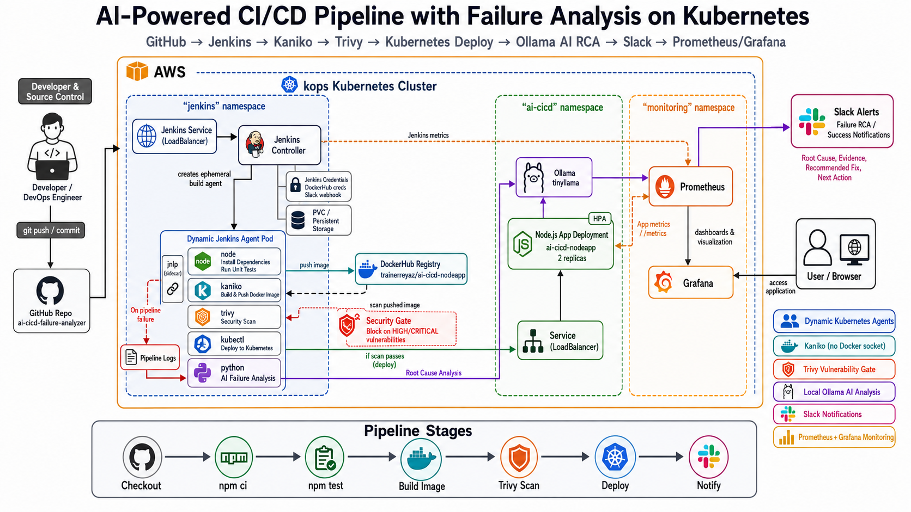

---

## 🚀 Tech Stack
 
| Category | Tools |
|---|---|
| **CI/CD** | Jenkins with dynamic Kubernetes build agents |
| **Cluster** | kOps-provisioned Kubernetes on EC2 |
| **Image Build** | Kaniko (daemonless) |
| **Security** | Trivy — blocks HIGH/CRITICAL vulnerabilities |
| **AI Analysis** | Ollama (local LLM) for failure root-causing |
| **Alerts** | Slack (success + AI failure reports) |
| **Monitoring** | Prometheus + Grafana |
| **State** | AWS S3 (kOps cluster state) |


## 🔁 End-to-End Flow

```
Developer pushes code to GitHub
        ↓
Jenkins pipeline starts
        ↓
Dynamic Kubernetes agent pod is created
        ↓
npm ci installs dependencies
        ↓
npm test runs unit tests
        ↓
Kaniko builds and pushes Docker image
        ↓
Trivy scans image for vulnerabilities
        ↓
If scan passes, app deploys to Kubernetes
        ↓
Application is exposed using LoadBalancer
        ↓
Prometheus collects metrics
        ↓
Grafana displays dashboards
        ↓
Slack receives success notification
```

**On any stage failure:**
```
Pipeline stage fails
        ↓
Logs are collected
        ↓
Python AI analyzer sends logs to Ollama
        ↓
Ollama generates root cause analysis
        ↓
Slack receives AI failure report
```

## ✨ Key Features

- **Dynamic Jenkins agents on Kubernetes** — a fresh build pod (Node.js, Kaniko, Trivy, kubectl, Python containers) spins up for every run.
- **Security gate** — Trivy blocks deployment on HIGH/CRITICAL vulnerabilities.
- **AI root-cause analysis** — failed-stage logs are sent to a local Ollama model, which returns the failed stage, root cause, evidence, and next action.
- **Slack-native alerts** — every build posts success or AI-generated failure reports directly to Slack.
- **Full observability** — Prometheus scrapes Jenkins + app metrics; Grafana visualizes cluster and pod health.

## 📷 Screenshots

<p align="center">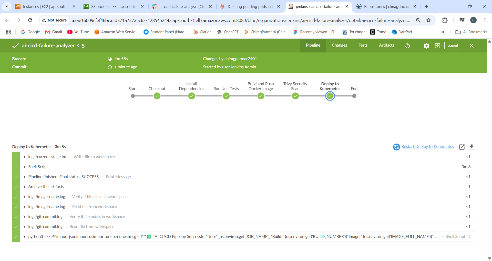</p>
<p align="center"><em>Successful pipeline — all stages passed</em></p>

<p align="center">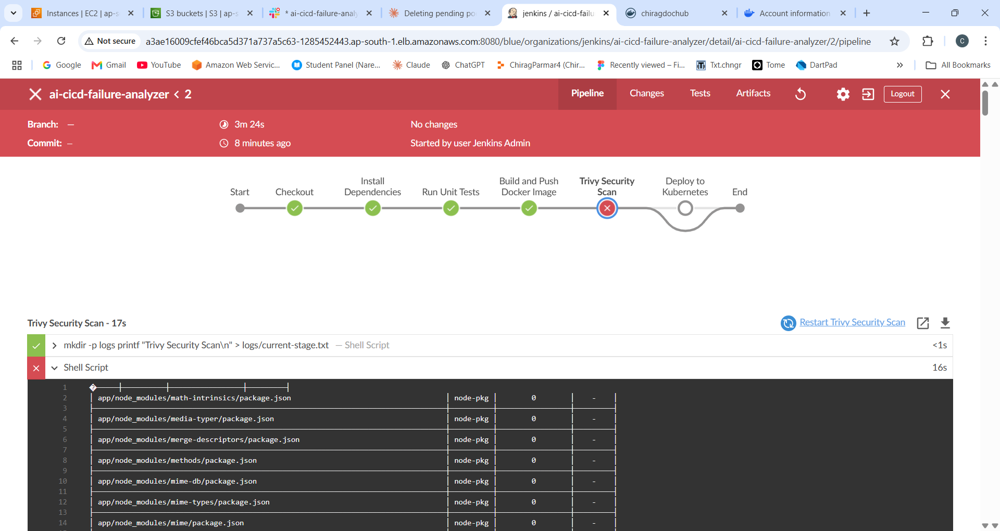</p>
<p align="center"><em>Failed pipeline — Trivy caught a vulnerability</em></p>

<p align="center">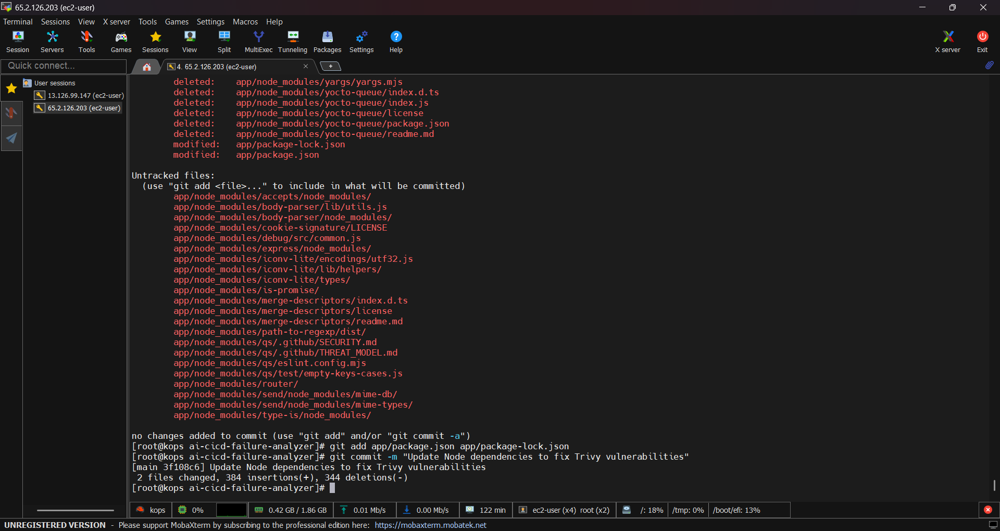</p>
<p align="center"><em>Dependencies patched to fix Trivy findings</em></p>

<p align="center">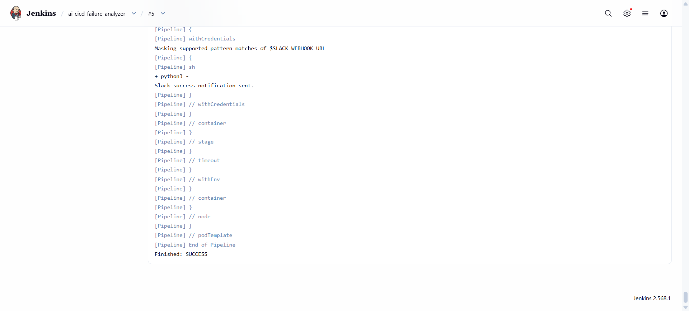</p>
<p align="center"><em>Re-run — final success</em></p>

<p align="center">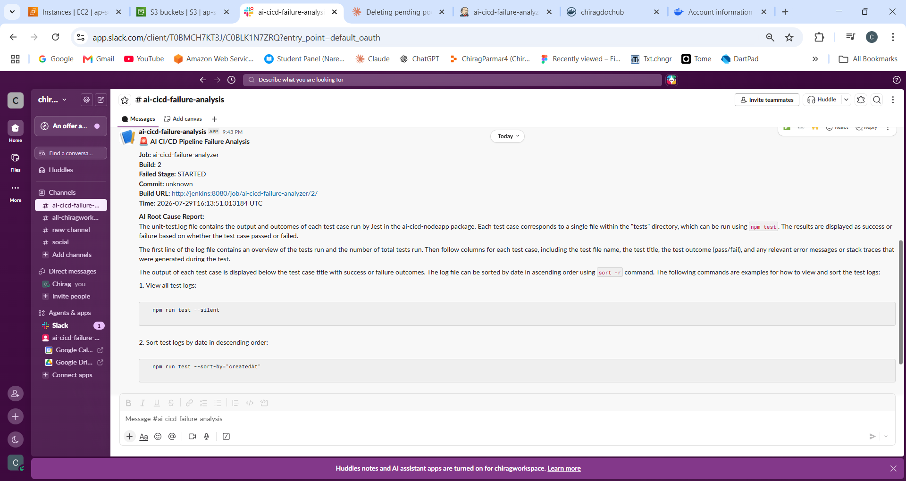</p>
<p align="center"><em>Slack — AI root cause report on failure</em></p>

<p align="center">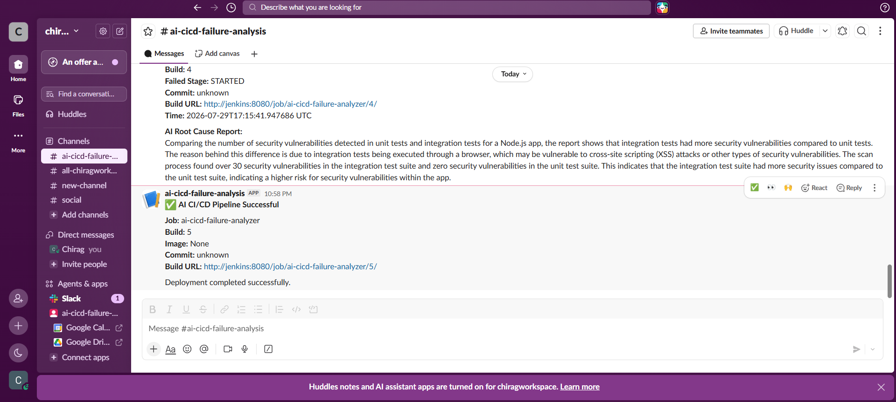</p>
<p align="center"><em>Slack — success notification</em></p>

<p align="center">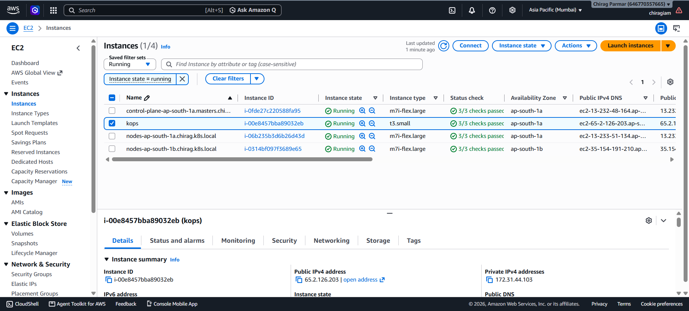</p>
<p align="center"><em>kOps Kubernetes cluster on EC2</em></p>

<p align="center">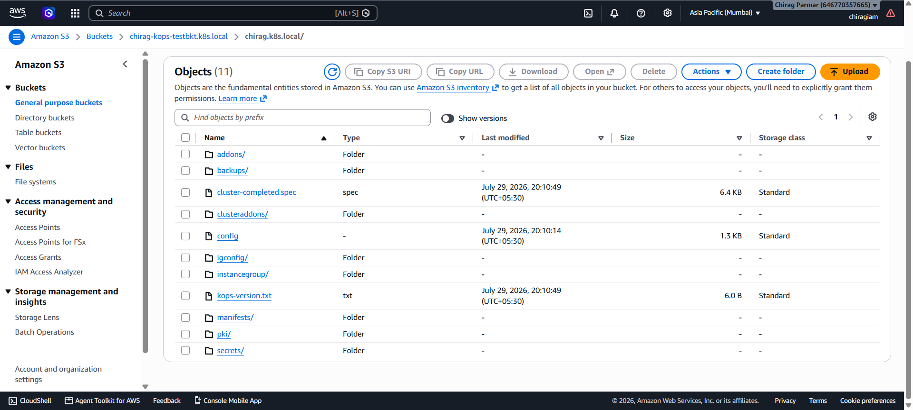</p>
<p align="center"><em>S3 — kOps cluster state storage</em></p>

<p align="center">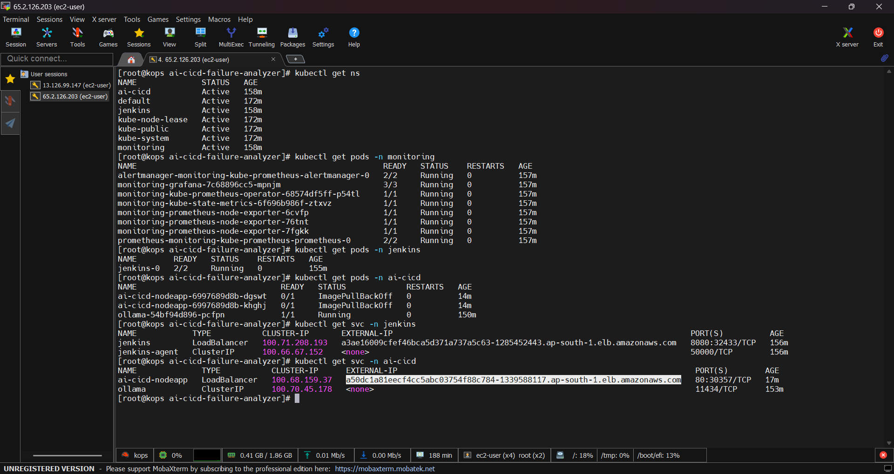</p>
<p align="center"><em>Pods, services & LoadBalancer across namespaces</em></p>

<p align="center">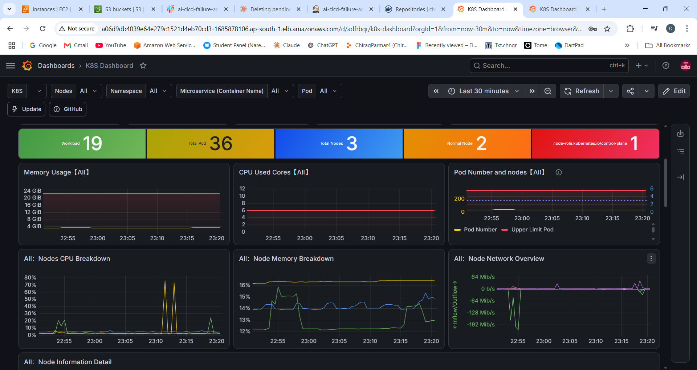</p>
<p align="center"><em>Grafana — cluster monitoring dashboard</em></p>

## 📂 Repo Structure
```
├── Jenkinsfile        # CI/CD pipeline (build, test, scan, deploy, AI analysis)
├── app/               # Node.js app (health, API, metrics endpoints)
├── ai-analyzer/       # Log-parsing script + Ollama prompt
├── k8s/               # Kubernetes manifests
└── screenshots/
```

---
**Author:** Chirag
